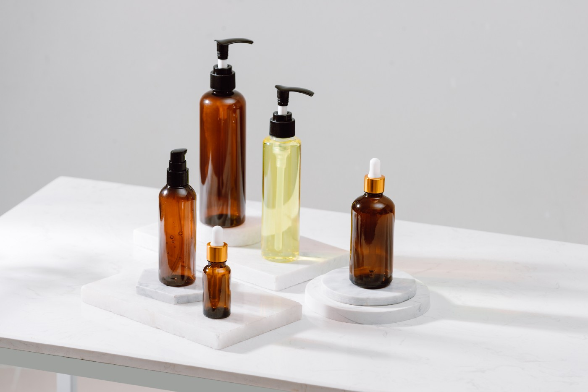

<!-- Main -->

<!-- One -->
<section id="one">
	

		<header class="major">
			<h2>Portfolio</h2>
		</header>
		
Testing Testing

	

</section>

<!-- Two -->
<section id="two" class="spotlights">
	<section>
		
		

			

				<header class="major">
					<h3>Digital Resource Library Translation Project</h3>
				</header>
				
I managed a translation project to help Italian students translate library pages for English-speaking international students. I drafted project plan documents, coordinated copy translation, revisions, and expert reviews, proofread the documents, drafted guides for the translation and editing process.

				<ul class="actions">
					<li><a href="writing samples/[Project Plan] DRL Translation Project.pdf" class="button">View Project Plan</a></li>
				</ul>
			

		

	</section>

	<section>
	
		

			

			 <header class="major">
				<h3>[Research Brief] An Overview of 4D Bioprinting </h3>
			</header>
			
I wrote a research brief as a response to a prompt in science, medical, and health writing.

			<ul class="actions">
				<li><a href="writing samples/4D-bioprinting-research-brief.pdf" class="button next">View Research Brief</a></li>
			</ul>
		

		

	</section>

	<section>
	
		

			

			 <header class="major">
				<h3>[Regulatory Guide] Non-Medicated Lotions & Perfumes</h3>
			</header>
			
I wrote a regulatory guide in response to a prompt for school.

			<ul class="actions">
				<li><a href="writing samples/regulatory-guide.pdf" class="button next">Open Regulatory Guide</a></li>
			</ul>
		

		

	</section>

	<section>
		
		

			

				<header class="major">
					<h3>[Flow Diagram] Datasite - Virtual Data Rooms & Bulk Rename</h3>
				</header>
				
I wrote instructional text for modals, errors, and interactions at a financial publisher. The company’s primary product - an online platform for virtual data rooms - provides users with “Bulk Rename”, an online editor to rename copious amounts of files at once. 

				<ul class="actions">
					<li><a href="images/Bulk Rename Modal Flow Diagram.jpg" class="button">View Bulk Rename Modal Flow
					</a></li>
				</ul>
			

		

	</section>

	<section>
		
		

			

				<header class="major">
					<h3>[User Research Findings] Mind in the Making eLearning Module
					</h3>
				</header>
				
I performed user research for an online course aimed to educate people working with families to build life skills in children. 

				<ul class="actions">
					<li><a href="images/MITM - Button Treatments - Recommendations.jpg" class="button">View Research Findings</a></li>
				</ul>
			

		

	</section>

<section>

	

		

		 <header class="major">
			<h3>[Functional Specifications]Bosch Tools - Parts & Services Online </h3>
		</header>
		
All of my UX skills were used to translate a traditional. paper-based to an online, digital system for the tools manufacturer based in Chicago, IL. I collaborated with clients and other teammates to make wireframes, write instructional text, and log annotations. 

		<ul class="actions">
			<li><a href="images/Razorfish - Bosch Tools - Wires Annotations.jpg" class="button next">Open Sample Wires & Annotations</a></li>

		</ul>
	

	

</section>

</section>

<!-- Three -->
